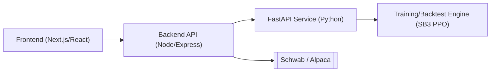

# StockBot Trading Pipeline

This document explains the end-to-end workflow of StockBot, a web-based deep‑reinforcement‑learning trading platform. It reflects the current codebase: FastAPI orchestration, Node/Express proxy, React frontend, and the SB3 PPO training and backtest engines.

---

## 1. System Overview

StockBot consists of a React frontend, a Node backend, a FastAPI service, and a Python training/backtest engine.

- Frontend: collects parameters for training/backtest, starts jobs, streams status, and downloads artifacts.
- Backend API: authenticates requests, persists run metadata, and proxies to the FastAPI service. Adds broker credential plumbing and policy upload.
 - FastAPI: exposes StockBot job/control routes, TensorBoard data, probability tools, and static run files.
 - Training/Backtest Engine: Python subprocesses launched by FastAPI for PPO training, evaluation, and backtests.

Service processes and key environment variables
- FastAPI (Python):
  - Entrypoint: stockbot/server.py
  - Env: ALLOWED_ORIGINS, INCLUDE_JARVIS (true/false), optional PROJECT_ROOT
  - Serves routes under /api/stockbot/* and static /runs/*
- Node/Express backend:
  - Entrypoint: backend/server.js
  - Env: BACKEND_URL, BACKEND_PORT, JWT_SECRET, REFRESH_SECRET, STOCKBOT_URL (URL of FastAPI), optional SSL_CERT|SSL_KEY|SSL_CA
  - Routes mounted under /api/* and proxies /api/stockbot/* → FastAPI
  - WebSocket proxy for /api/stockbot/runs/:id/ws bridging to FastAPI WS

---

## 2. Pipeline Architecture

### 2.1 Frontend
- Training wizard with sections: Dataset, Features, Costs & Execution, CV/Stress, Regime, Model, Sizing, Reward & Logging, Downloads.
- Builds a typed payload (see 4.1) and posts to the backend at `/api/stockbot/train`.
- Streams job status via Server‑Sent Events (SSE) and shows artifacts; can cancel a run and download a ZIP bundle.

### 2.2 Backend API (Node/Express)
- JWT-protected routes; MongoDB used for users and preferences.
- Proxies to the Python service using `STOCKBOT_URL`:
  - POST `/stockbot/train`, `/stockbot/backtest`, `/stockbot/cv`
  - GET `/stockbot/runs`, `/stockbot/runs/:id`, `/stockbot/runs/:id/stream` (SSE)
  - Artifacts: `/runs/:id/files/:name`, `/runs/:id/bundle`
  - TensorBoard: `/runs/:id/tb/tags|scalars|scalars-batch|histograms|grad-matrix`
  - Policies: POST `/policies/upload` (for `.zip` SB3 models)
  - Insights: GET `/insights`, `/highlights` (broker‑aware)
- Live trading proxies exist: `/trade/start`, `/trade/stop`, `/trade/status` (FastAPI endpoints for these are reserved; wiring is in progress).

### 2.3 FastAPI Service (Python)
- StockBot routes (`stockbot/api/routes/stockbot_routes.py`):
  - POST `/api/stockbot/train`, `/backtest`, `/cv`
  - GET `/api/stockbot/runs`, `/runs/{id}`, `/runs/{id}/stream` (SSE) and optional `/runs/{id}/ws` (WebSocket)
  - Artifacts: `/runs/{id}/artifacts`, `/runs/{id}/files/{name}`, `/runs/{id}/bundle`, `/runs/{id}/cancel`, `DELETE /runs/{id}`
  - TensorBoard: `/runs/{id}/tb/tags|scalars|scalars-batch|histograms|grad-matrix`
  - Policies upload: POST `/policies`
  - Insights & Highlights: POST `/insights`, `/highlights`
- Probability tools (`/api/stockbot/prob`): train/infer light HMM‑based regime models.
- Static: mounts `stockbot/runs` under `/runs` for direct file access.

Run lifecycle
- On POST `/train` or `/backtest`, a run record is created with status `QUEUED` in a SQLite registry (`stockbot/run_registry.py`) and an on‑disk folder `stockbot/runs/<id>/`.
- The request payload is snapshotted (`payload.json`, `config.snapshot.yaml`). Data prep writes `dataset_manifest.json` and `obs_schema.json`.
- The subprocess is launched with `PYTHONPATH` set to project root; stdout/stderr stream to `job.log`.
- Status transitions: `QUEUED` → `RUNNING` → `SUCCEEDED|FAILED|CANCELLED`. SSE/WS reflect these changes live.

### 2.4 Training/Backtest Engine
- Trainer entrypoint: `python -m stockbot.rl.train_ppo`.
  - Reads an `EnvConfig` YAML (see 5) and infers train/eval splits when not provided.
  - Builds environments with `make_env` (single‑asset or portfolio), wraps with `as_float32`, `ObsNorm` (optional), and `Monitor`.
  - Policies: `mlp`, `window_cnn`, `window_lstm` feature extractors.
  - PPO knobs: `n_steps`, `batch_size`, `learning_rate`, `gamma`, `gae_lambda`, `clip_range`, `ent_coef`, `vf_coef`, `max_grad_norm`, `dropout`.
  - Callbacks: `EvalCallback`, `StopTrainingOnRewardThreshold`, and diagnostics with gradient logging.
  - Outputs: `ppo_policy.zip`, TensorBoard event files, CSV logs, `evaluations.npz`.
- Backtest entrypoint: `python -m stockbot.backtest.run` to evaluate a saved `.zip` or a built‑in baseline strategy.

---

## 3. Data & Feature Pipeline

The data layer has two paths that work together.

- Providers: `stockbot/ingestion/yfinance_ingestion.py` implements `IngestionProvider` for OHLCV. Interfaces live in `ingestion_base.py`.
- Classic adapters (used by gym envs):
  - `BarWindowSource` and `PanelSource` in `stockbot/env/data_adapter.py` fetch bars, compute indicators, align multi‑asset panels, and enforce lookback constraints.
  - Feature engineering uses the built‑in indicator set (log returns, RSI, ROC, MACD, stochastics, ATR, SMA/EMA, volume z‑scores). If `FeatureConfig.use_custom_pipeline = true`, it tries `stockbot/ingestion/feature_engineering.py` (rich TA + optional `pandas_ta`).
- Modern feature builder (used during API prep and CV):
  - `stockbot/ingestion/parquet_cache.ensure_parquet` creates cached CSV/“parquet” files for requested symbols and date ranges.
  - `stockbot/ingestion/dataset_manifest.build_manifest` records the dataset slice and sources.
  - `stockbot/features/builder.build_features` rolls `(T, lookback, N, F)` windows with embargo and optional normalisation.
  - `stockbot/env/env_builder.prepare_env` wires this flow and writes `dataset_manifest.json` and `obs_schema.json` into the run directory.
- Normalisation & casting: `ObsNorm` (training: updates stats; eval: freezes) and `as_float32` ensure stable dtype/shape.

Dataset manifest (stockbot/ingestion/dataset_manifest.py)
- Fields: symbols, interval, adjusted, start, end, vendor, parquet_map, content_hash.
- content_hash is a SHA-256 over parameters and file paths/sizes/mtimes. Identical payload yields the same hash; changing interval or adjusted_prices changes the hash.

---

## 4. Request Parameters

### 4.1 Training Endpoint `/api/stockbot/train`

The frontend submits a rich, typed payload (see `frontend/src/components/Stockbot/NewTraining/payload.ts`). Key groups:

- Dataset: `symbols[]`, `start_date`, `end_date`, `interval` (1d|1h|15m), `adjusted_prices`, `lookback`, `train_eval_split`, `custom_ranges?`.
- Features: `feature_set` (ohlcv|ohlcv_ta_basic|ohlcv_ta_rich), `ta_basic_opts?`, `normalize_observation`, `embargo_bars`.
- Costs & Execution: `commission_per_share`, `taker_fee_bps`, `maker_rebate_bps`, `half_spread_bps`, `impact_k`, `fill_policy` (next_open|vwap_window), `vwap_minutes?`, `max_participation`.
- CV & Stress: `cv = { scheme: purged_walk_forward, n_folds, embargo_bars }`, `stress_windows[]`.
- Regime: `enabled`, `n_states`, `emissions`, `features[]` (ret|vol|skew|dispersion|breadth), `append_beliefs_to_obs`.
- Model: `policy` (mlp|window_cnn|window_lstm), `total_timesteps`, `n_steps`, `batch_size`, `learning_rate`, `gamma`, `gae_lambda`, `clip_range`, `ent_coef`, `vf_coef`, `max_grad_norm`, `dropout`, `seed?`.
- Sizing: `mapping_mode` (simplex_cash|tanh_leverage), `invest_max?`, `gross_leverage_cap?`, `max_step_change`, `rebalance_eps`, `kelly{...}`, `vol_target{...}`, `guards{...}`.
- Reward: `base` (delta_nav|log_nav), `w_drawdown`, `w_turnover`, `w_vol?`, `w_leverage?`.
- Artifacts: `save_tb`, `save_action_hist`, `save_regime_plots`.

Server behavior:
- Persists `config.snapshot.yaml` (payload), `payload.json`, starts `train_ppo` as a subprocess, streams logs to `job.log`, and surfaces artifacts via API.
- SSE init event includes a hash of the payload and parsed configuration for client caching.

### 4.2 Backtest Endpoint `/api/stockbot/backtest`

- Parameters: `policy` (baseline name: flat|equal|first_long|random|buy_hold or `path/to/ppo_policy.zip`), `config_path`, optional `symbols[]`, `start`, `end`, `out_tag` or `out_dir`, and `normalize`.
- Outputs: `report/equity.csv`, `report/orders.csv`, `report/trades.csv`, `report/summary.json`, `report/metrics.json`.

### 4.3 JSON Schema (backend Pydantic models)

- DatasetModel
  - `symbols: List[str]`
  - `start_date: str`, `end_date: str` (ISO dates)
  - `interval: "1d"|"1h"|"15m" = "1d"`
  - `adjusted_prices: bool = true`
  - `lookback: int = 64`
  - `train_eval_split: "last_year"|"80_20"|"custom_ranges" = "last_year"`
  - `custom_ranges?: List[{ train: [str,str], eval: [str,str] }]`
- FeaturesModel
  - `feature_set: ("ohlcv"|"ohlcv_ta_basic"|"ohlcv_ta_rich")[] = ["ohlcv_ta_basic"]`
  - `ta_basic_opts?: { rsi?: boolean, macd?: boolean, bbands?: boolean }`
  - `normalize_observation: boolean = true`
  - `embargo_bars: int = 1`
- CostsModel
  - `commission_per_share: float = 0.0005`
  - `taker_fee_bps: float = 1.0`, `maker_rebate_bps: float = -0.2`
  - `half_spread_bps: float = 0.5`, `impact_k: float = 8.0`
- ExecutionModel
  - `fill_policy: "next_open"|"vwap_window" = "next_open"`
  - `vwap_minutes?: int = 15`, `max_participation: float = 0.1`
- CVModel
  - `scheme: "purged_walk_forward"`, `n_folds: int = 6`, `embargo_bars: int = 5`
- StressWindow
  - `label: string`, `start: string`, `end: string`
- RegimeModel
  - `enabled: boolean = true`, `n_states: int = 3`, `emissions: string = "gaussian"`
  - `features: ("ret"|"vol"|"skew"|"dispersion"|"breadth")[] = ["ret","vol","dispersion"]`
  - `append_beliefs_to_obs: boolean = true`
- ModelModel
  - `policy: "mlp"|"window_cnn"|"window_lstm" = "window_cnn"`
  - `total_timesteps: int = 1_000_000`, `n_steps: int = 4096`, `batch_size: int = 1024`
  - `learning_rate: float = 3e-5`, `gamma: float = 0.997`, `gae_lambda: float = 0.985`
  - `clip_range: float = 0.15`, `ent_coef: float = 0.04`, `vf_coef: float = 1.0`
  - `max_grad_norm: float = 1.0`, `dropout: float = 0.1`, `seed?: int`
- SizingModel
  - `mapping_mode: "simplex_cash"|"tanh_leverage" = "simplex_cash"`
  - `invest_max?: float = 0.7` (simplex only), `gross_leverage_cap?: float = 1.5` (tanh only)
  - `max_step_change: float = 0.08`, `rebalance_eps: float = 0.02`
  - `kelly: { enabled: boolean, lambda: float, f_max?, ema_alpha?, state_scalars? }`
  - `vol_target: { enabled: boolean, annual_target: float, min_vol?, clamp?{min,max} }`
  - `guards: { daily_loss_limit_pct: float, per_name_weight_cap: float, sector_cap_pct? }`
- RewardModelNew
  - `base: "delta_nav"|"log_nav" = "log_nav"`
  - `w_drawdown: float = 0.10`, `w_turnover: float = 0.001`, `w_vol?: float`, `w_leverage?: float`
- ArtifactsModel
  - `save_tb: boolean = true`, `save_action_hist: boolean = true`, `save_regime_plots: boolean = true`

BacktestRequest
- `config_path: str` (default `stockbot/env/env.example.yaml`)
- `policy: str` (baseline name or `.zip` path)
- `symbols?: string[]`, `start?: string`, `end?: string`
- `out_tag?: string`, `out_dir?: string`, `run_id?: string`, `normalize: bool = true`

---

## 5. Reinforcement‑Learning Environment

Environment schema (`stockbot/env/config.py`) is YAML‑serialised and used by the PPO trainer. Highlights:

- FeeModel: commissions, taker/maker fees, half‑spread bps, borrow fees.
- MarginConfig: gross/net leverage caps, per‑name caps, intraday flag, daily loss and drawdown kill‑switches.
- ExecConfig: order type, limit offsets, max participation, impact parameter, spread source, fill policy.
- RewardConfig: base mode and penalties (`w_drawdown`, `w_turnover`, `w_vol`, `w_leverage`), Sharpe options.
- EpisodeConfig: `lookback`, `start_cash`, `max_steps`, `allow_short`, `rebalance_eps`, `randomize_start`, `horizon`, `min_hold_bars`, mapping/turnover knobs (`mapping_mode`, `invest_max`, `max_step_change`).
- FeatureConfig: indicator list, `use_custom_pipeline`, `window` length.

Each run stores a snapshot of the payload and resolved config next to artifacts.

Observation spaces and shapes
- StockTradingEnv
  - `window: (lookback, F)`; columns include `open, high, low, close, volume` plus selected indicators.
  - `portfolio: (8,)` = `[pos, cash_frac, margin_used, unrealized, drawdown, realized, rolling_vol, turnover]`.
  - `prob: (5,)` = `[p_bull, p_bear, p_up, mu_over_sigma, sigma]` (heuristic beliefs used in tests).
- PortfolioTradingEnv
  - `window: (lookback, N, F)` for N symbols.
  - `portfolio: (7+N,)` = `[cash_frac, margin_used, drawdown, unrealized, realized, rolling_vol, turnover] + weights(N)`.
  - Optional `gamma: (K,)` if regime posteriors are provided.

Action mapping
- `simplex_cash`: action logits `(N+1)` → `invest_frac = sigmoid(gate) * invest_max`, `alloc = softmax(assets)`, `w = invest_frac * alloc`, turnover clamp via `max_step_change`.
- `tanh_leverage`: action `(N)` → `tanh` weights; cap gross leverage and per‑name weights.

Reward shaping
- Base: delta NAV or log NAV; penalties applied: `w_drawdown * DD`, `w_turnover * |Δw|`, optional `w_vol`, `w_leverage`.

---

## 6. Markov Decision Process

RL models the environment as an MDP: observe state, choose action, receive reward, transition to next state. Transitions depend only on current state/action (Markov property).

---

## 7. Environment Builder

`make_env` constructs a single‑asset (`StockTradingEnv`) or multi‑asset (`PortfolioTradingEnv`) environment from `EnvConfig` and date splits.

- Observations:
  - `window`: last `lookback` bars with features in `(L, N, F)`.
  - `portfolio`: vector with cash fraction, leverage, drawdown, unrealised/realised P&L, rolling vol, and turnover; in portfolio env, includes current weights.
  - Optional regime/probability features are appended when enabled.
- Actions:
  - Single‑asset: continuous position in `[-1,+1]` or discrete `{short,flat,long}`.
  - Portfolio: either
    - `simplex_cash`: logits of length `N+1` → softmax allocation with a gated invest fraction `≤ invest_max`; per‑step turnover is capped by `max_step_change`, remainder stays in cash.
    - `tanh_leverage`: `N` logits → `tanh` weights with gross/per‑name caps.
- Reward shaping: delta/log NAV with optional penalties for drawdown, turnover, volatility, and leverage.
- Execution & costs: unified cost model (`execution_costs.py`) for commissions, spread/fees, and impact; supports `next_open` and `vwap_window` fill styles with participation caps.

Execution & costs details
- Order planning: `backtest/fills.py` computes quantities from Δweights, caps per‑bar participation (`max_participation`), supports `next_open`/`vwap_window`.
- Cost model: `backtest/execution_costs.py` applies
  - `commission = commission_per_share * |qty|`
  - `spread = 2 * half_spread_bps/1e4 * |notional|`
  - `fees = (taker_fee_bps or maker_rebate_bps)/1e4 * |notional|`
  - `impact = impact_k * sqrt(participation)/1e4 * |notional|`
  - returns realized price and `cost_bps` with a breakdown.

---

## 8. Backtesting Engine

`stockbot/backtest/run.py` runs a deterministic episode using a baseline or an SB3 policy. It writes `equity.csv`, `orders.csv`, `trades.csv`, a `summary.json`, and computes metrics (total return, vol, Sharpe/Sortino, Calmar, max drawdown, turnover, hit rate, average trade P&L).

Cross‑validation scaffolding (`backtest/cv.py`) integrates the modern data pipeline and execution cost model for purged walk‑forward analysis.

---

## 9. Hyper‑parameter Tuning

### 9.1 PPO Knobs

- n_steps: larger values stabilise gradients (e.g., 4096).
- batch_size: divide `n_steps`; commonly `n_steps/4`.
- learning_rate: 3e‑5–5e‑5 (lower can reduce clipping pressure).
- gamma: 0.995–0.997.
- gae_lambda: 0.98–0.985.
- clip_range: 0.15–0.30.
- ent_coef: 0.02–0.05.
- vf_coef: 0.8–1.0.
- max_grad_norm: 1.0.
- dropout: regularisation for CNN/LSTM extractors.
- seed: set for reproducibility when comparing runs.

### 9.2 Environment & Reward

- mapping_mode: `simplex_cash` (long‑only) or `tanh_leverage` (long/short).
- invest_max: cap invested fraction (with `simplex_cash`).
- max_step_change: cap per‑step target change (turnover throttle).
- rebalance_eps: micro‑rebalance gate.
- penalties: `w_turnover`, `w_drawdown`, `w_vol`, `w_leverage`.
- lookback: bars in the observation window.

---

## 10. Model Architectures

- WindowCNNExtractor: treats `(L, N, F)` as a multi‑channel image, fuses with portfolio context.
- WindowLSTMExtractor: flattens to `(L, N*F)` and applies an LSTM.
- MLP: SB3 default for simpler scenarios.

---

## 11. Diagnostics & Telemetry

- TensorBoard: episodic reward, policy/value losses, entropy, gradient norms; includes gradient‑by‑layer matrix exposed via API (`/tb/grad-matrix`).
- SSE/WebSocket status: `/runs/{id}/stream` and `/runs/{id}/ws` provide live job updates.
- Artifacts map: metrics/equity/orders/trades/summary, config snapshot, model, job log, payload.

SSE stream protocol
- Endpoint: `GET /api/stockbot/runs/{id}/stream`
- Events
  - `init`: `{ payload_hash: string, config: object }` parsed from `config.snapshot.yaml`
  - data events: `{ id, type, status, out_dir, created_at, started_at, finished_at, error }`
- Terminates on terminal status.

TensorBoard API semantics
- ETag computed from event file mtimes/sizes; clients should send `If-None-Match` to get 304 when unchanged.
- `GET /runs/{id}/tb/tags` → `{ scalars: string[], histograms: string[] }` with `ETag` header.
- `GET /runs/{id}/tb/scalars?tag=` → `{ tag, points: [{step, wall_time, value}, ...] }` (dedup by step).
- `GET /runs/{id}/tb/histograms?tag=` → histogram series with bucket triples `[left,right,count]`.
- `GET /runs/{id}/tb/grad-matrix` → compact layer × step matrix from `grads/by_layer/*`.

Artifact endpoints
- `GET /runs/{id}/artifacts` → map of safe names to file routes (present only if file exists):
  - `metrics, equity, orders, trades, summary, config, model, job_log, payload`
- `GET /runs/{id}/files/{name}` streams a specific artifact; `GET /runs/{id}/bundle?include_model=1` returns a ZIP bundle.

---

## 12. Example Configuration

High‑performing CNN setup (`window_cnn`):

- learning_rate = 3e‑5
- n_steps = 4096, batch_size = 1024
- gamma = 0.997, gae_lambda = 0.985
- clip_range = 0.15, ent_coef = 0.04, vf_coef = 1.0
- max_grad_norm = 1.0
- Env mapping `simplex_cash` with `invest_max = 0.70`, `max_step_change = 0.08`, `rebalance_eps = 0.02`
- Reward penalties `w_turnover = 0.001`, `w_drawdown = 0.10`

This favours steady policy updates and strong risk control. For bear markets, consider `tanh_leverage` or hedging assets to handle downtrends.

---

## 13. Visualisation & Reports

- Training: TensorBoard events (scalars, histograms), optional action histograms and regime diagnostics.
- Backtest: `equity.csv`, `trades.csv`, `orders.csv`, `metrics.json` for plotting equity, drawdown, and weights.

---

## 14. Notes & Recommendations

- The backend exposes rich run management and TensorBoard endpoints; the frontend consumes SSE to keep status live.
- Policy uploads are supported (SB3 `.zip`) for evaluation/backtests.
- Live trading routes are proxied in Node and reserved in the FastAPI API; server‑side wiring is being added.
- Validate environment logic and reward shaping early; monitor entropy and gradients; compare vs. baselines.
 - Validate environment logic and reward shaping early; monitor entropy and gradients; compare vs. baselines.

---

## 15. Regime/HMM Module

- Library: `stockbot/signals/hmm_regime.py` implements a Gaussian HMM with diagonal covariances; saves and loads parameters (`.npz`).
- API: FastAPI routes under `/api/stockbot/prob`:
  - POST `/train`: trains a small HMM on a float series, writes artifacts to a directory.
  - POST `/infer`: returns posteriors, p_up, expected return and variance.
- Training‑time prep: `stockbot/pipeline.py:prepare_from_payload()` optionally fits an HMM on rolled windows and appends `regime_posteriors` into the returned metadata when `payload.regime` is provided.
- Env integration: `PortfolioTradingEnv` accepts an optional `regime_gamma` (posteriors) and `RegimeScalerConfig`; when present, an exposure multiplier is applied in sizing (`regime_exposure_multiplier`).
- Frontend knobs: `regime.enabled|n_states|features|append_beliefs_to_obs` are accepted by the backend models; wiring of beliefs into PPO observations is planned (payload captured; beliefs are produced at prep time; training env wiring is in progress).

Artifacts (planned/partial):
- `regime_posteriors.npz`/timeline CSV and state KPIs are planned; current HMM APIs return arrays via `/infer` and training saves model weights via the prob module.

---

## 16. Milestones & Implementation Status (P0–P6)

P0 – Frontend Refactor
- Implemented: 8 accordion form sections; strong client validation and a single `buildTrainPayload()` mapper in `frontend/.../payload.ts`.
- Acceptance: invalid combos (e.g., batch_size vs n_steps) are blocked in UI; payload structure matches backend pydantic models.

P1 – Backend & FastAPI Schemas
- Implemented: Express proxies forward raw payload to Python; FastAPI has pydantic models for dataset/features/costs/execution/cv/stress/regime/model/sizing/reward/artifacts.
- Snapshotting: server writes `config.snapshot.yaml` (payload) and `payload.json` in `stockbot/runs/<id>/`. `env_builder.prepare_env()` writes `dataset_manifest.json` and `obs_schema.json`.
- Reproduce: retrieve snapshot + payload via `/api/stockbot/runs/{id}/files/{config|payload}` and artifacts map via `/artifacts`. Dedicated “snapshot” endpoint is pending; SSE init includes a `payload_hash` and parsed config.

P2 – Data Integrity Layer
- Implemented: versioned CSV/“parquet” cache with deterministic `content_hash` in `dataset_manifest.json` (symbols, interval, adjusted, slice, vendor, files). Feature builder enforces time‑major windows and embargo.
- Acceptance: identical payload → same `content_hash`; changing `adjusted_prices` or `interval` → different hash.

P3 – Costs/Impact & Order Simulator
- Implemented: unified cost params (commissions, taker/maker, half‑spread, impact) shared by env and backtest; execution models `next_open` and `vwap_window` with participation caps.
- Backtest outputs: equity, orders, trades, metrics (`stockbot/backtest/run.py`).

P4 – Purged Walk‑Forward CV + Stress Harness
- Implemented: `backtest/cv.py` runs purged WF splits with embargo and integrates the cost model; reports per‑fold scaffolding. `reports/stress.py` runs P2 prep per stress window (placeholder KPIs saved).

P5 – HMM Regime + Regime‑Aware Obs & Sizing
- Implemented: HMM model (`signals/hmm_regime.py`) and API (`/api/stockbot/prob`); optional prep‑time posteriors and regime‑aware multiplier in sizing. Env supports `gamma` obs when provided.
- TODO: fully wire beliefs into PPO observations from payload when `append_beliefs_to_obs=true`, add regime artifacts (timeline, heatmap) and per‑state KPIs in reports.

P6 – Risk Layers, Guardrails, Live Canary
- Implemented: fractional‑Kelly, volatility targeting, and guardrails (daily loss limit, per‑name cap, gross leverage cap) in `strategy/sizing.py` and `strategy/risk_layers.py`, used by the portfolio env.
- Live: Node proxies for `/trade/start|stop|status` exist; Python endpoints are reserved and will be implemented alongside canary ramp logic.

Run Registry Fields (current vs planned)
- Current record: `id`, `type`, `status`, `out_dir`, `pid`, timestamps, and `meta` including paths to `config.snapshot.yaml` and `payload.json`.
- Files alongside runs: `dataset_manifest.json` (with `content_hash`), `obs_schema.json`, TB events, `job.log`, model zip, evaluation outputs.
- Planned additions: `git_sha`, `dataset_manifest_hash` promotion into run record, `cv_report.json`, `stress_report.json`, `metrics_summary.json`, warnings/errors.

UI “Training Results” (planned)
- Costs panel: gross vs net equity; turnover vs net slippage.
- Regime panel: stacked π_t timeline; KPIs by state; transition heatmap.
- Learning: losses, entropy, grad‑norms, explained variance; TB gradient matrix.
- Compare runs: diff metrics with bootstrap CIs.

---

## 17. Developer Reference

CLI usage
- Train: `python -m stockbot.rl.train_ppo --config stockbot/env/env.example.yaml --policy window_cnn --normalize --timesteps 1_000_000 --out ppo_cnn_run`
- Backtest (baseline): `python -m stockbot.backtest.run --config stockbot/env/env.example.yaml --policy equal --start 2022-01-01 --end 2022-12-31 --out equal_eval`
- Backtest (SB3 zip): `python -m stockbot.backtest.run --config stockbot/env/env.example.yaml --policy stockbot/runs/ppo_cnn_run/ppo_policy.zip --start ... --end ... --out ppo_eval`

Local dev
- Windows: `stockbot/run_dev.bat` creates venv, installs `requirements.txt`, runs Uvicorn on `:5002` with debugpy.
- macOS/Linux: `stockbot/run_dev.command` activates venv and runs reloader.
- Node backend runs with HTTPS if certs are provided; falls back to HTTP in non‑production.

Security & auth
- Node protects routes with JWT (`protectRoute`) and proxies errors from Python; rate limits set with higher budget on `/api/stockbot/*`.
- FastAPI currently comments out API key enforcement; enable a dependency when applying service‑to‑service auth.

Environment variables
- Node: `BACKEND_URL, BACKEND_PORT, JWT_SECRET, REFRESH_SECRET, STOCKBOT_URL, SSL_CERT, SSL_KEY, SSL_CA`.
- Python: `ALLOWED_ORIGINS, INCLUDE_JARVIS, PROJECT_ROOT`.

Error propagation
- `startTrainProxy` and peers forward status and body from the Python service to keep frontend error detail intact.
