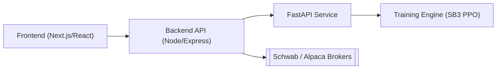
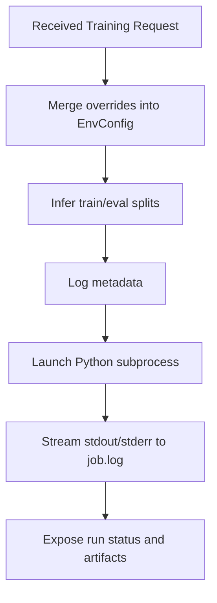
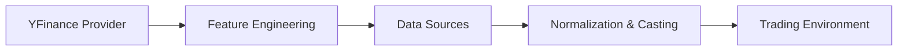
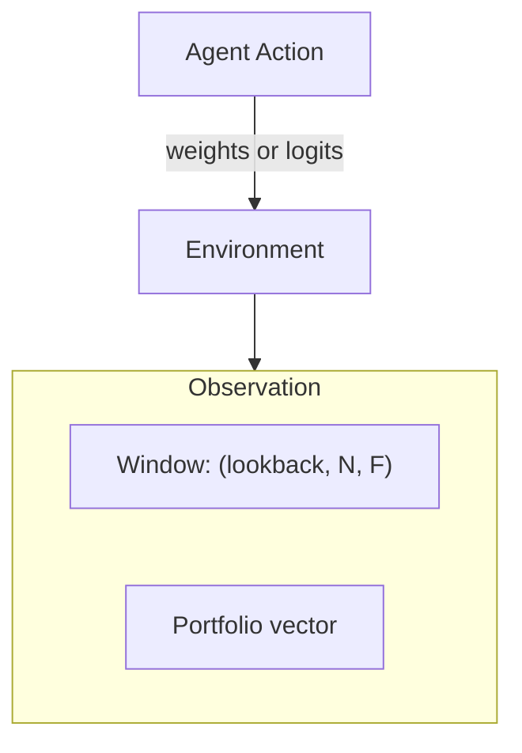

# StockBot Trading Pipeline

This document explains the end-to-end workflow of **StockBot**, a web-based deep‑reinforcement-learning trading platform.  It is intended for new users who want to understand how data flows through the system and how training, backtesting, and live trading operate.

---

## 1. System Overview

StockBot consists of three services and a training engine.

* **Frontend** – collects user input for training and backtesting and streams job status.
* **Backend API** – authenticates requests, stores run metadata, and proxies calls to the FastAPI service.
* **FastAPI Service** – orchestrates reinforcement‑learning tasks and manages broker operations.
* **Training Engine** – Python subprocess launched by the service that trains or evaluates PPO policies.

---

## 2. Pipeline Architecture

### 2.1 Frontend
* Displays forms for new training runs and backtests.
* Sends parameters (symbols, date ranges, policy type, etc.) to the backend.
* Shows real‑time run status via REST or WebSocket and allows artifact downloads.

### 2.2 Backend API
* Entry point with JWT authentication and MongoDB persistence.
* Forwards training, backtest, and live‑trading requests to the FastAPI service using Axios.
* Proxies WebSockets for real‑time status and exposes routes for run management, TensorBoard data, and AI insights.
* Hosts broker endpoints integrating Schwab and Alpaca.

### 2.3 FastAPI Service
* Launches RL tasks and handles broker operations.

* Training endpoint `/api/stockbot/train` performs the steps in the diagram above.
* Backtest endpoint `/api/stockbot/backtest` loads a saved model or baseline, builds the evaluation environment, and produces equity, orders, and trade CSVs along with metrics.
* Live trading endpoints `/api/stockbot/trade/*` start or stop sessions and query the current trading status.

### 2.4 Training Engine
* Invoked as `python -m stockbot.rl.train_ppo`.
* Loads YAML configuration into an `EnvConfig` snapshot describing symbols, date ranges, features, and reward weights.
* Builds environments via `make_env`, selecting `StockTradingEnv` or `PortfolioTradingEnv` and optional wrappers such as `ObsNorm` and `Monitor`.
* Creates policy using one of three feature extractors: `MLP`, `WindowCNN`, or `WindowLSTM`.
* Configures PPO hyper‑parameters (e.g., `n_steps`, `learning_rate`, `gamma`, `gae_lambda`, `clip_range`, `ent_coef`, `vf_coef`, `max_grad_norm`, `dropout`).
* Trains with `EvalCallback`, TensorBoard diagnostics, and optional early stop using `StopTrainingOnRewardThreshold`.
* Saves the final policy as `ppo_policy.zip` and logs run data to TensorBoard and CSV.

---

## 3. Data & Feature Pipeline

Market data flows through a series of adapters and feature engines.

* **Providers** – `stockbot/ingestion/yfinance_ingestion.py` fetches adjusted OHLCV bars from Yahoo Finance. Provider interfaces live in `ingestion_base.py` and define rate limits and capabilities.
* **Feature engineering** – `stockbot/env/data_adapter.py` computes log returns, RSI, moving averages, MACD, stochastics, ATR, and volume z‑scores. When `FeatureConfig.use_custom_pipeline` is enabled, `stockbot/ingestion/feature_engineering.py` adds more indicators and `pandas_ta` hooks.
* **Data adapters** – `BarWindowSource` builds feature windows per symbol while `PanelSource` aligns multi‑asset panels and removes rows with missing features.
* **Normalization & casting** – `ObsNorm` tracks running mean/variance and freezes stats for evaluation. The `as_float32` wrapper guarantees consistent dtypes and shapes.

---

## 4. Request Parameters

### 4.1 Training Endpoint `/api/stockbot/train`

| Parameter | Type | Description |
|-----------|------|-------------|
| `symbols` | `list[str]` | Tickers to include in the environment |
| `start_date` / `end_date` | `str` | ISO date range for the data slice |
| `policy` | `str` | Feature extractor: `mlp`, `window_cnn`, or `window_lstm` |
| `total_timesteps` | `int` | Number of environment steps for learning |
| `eval_freq` | `int` | Steps between evaluation runs and checkpoints |
| `seed` | `int` | Random seed for reproducibility |

### 4.2 Backtest Endpoint `/api/stockbot/backtest`

| Parameter | Type | Description |
|-----------|------|-------------|
| `model_path` | `str` | Path to a saved policy or baseline name |
| `symbols` | `list[str]` | Optional list of tickers for evaluation |
| `start_date` / `end_date` | `str` | Optional date range override |
| `deterministic` | `bool` | Use deterministic actions during evaluation |

Common environment parameters are defined in the YAML snapshot (`EnvConfig`), including `lookback`, `invest_max`, `max_step_change`, `rebalance_eps`, and reward weights (`w_turnover`, `w_drawdown`, `w_vol`, `w_leverage`).

---

## 5. Reinforcement-Learning Environment

Environment configuration resides in dataclasses under `stockbot/env/config.py` and is serialized to YAML. Key elements:

* **FeeModel** – commissions, borrow fees, and slippage.
* **MarginConfig** – leverage caps, position limits, and kill switches.
* **ExecConfig** – order type, limit offsets, participation caps, and impact parameter.
* **RewardConfig** – base reward mode plus penalties for drawdown, turnover, volatility, and leverage.
* **EpisodeConfig** – lookback window, start cash, and action‑space options (`weights`, `orders`, `discrete`), `allow_short`, mapping mode (`simplex_cash` or `tanh_leverage`), `invest_max`, `max_step_change`, `rebalance_eps`, and `min_hold_bars`.
* **FeatureConfig** – indicator list, `use_custom_pipeline` flag, and window length.

A snapshot of these values is stored with each run (e.g., `env.example.yaml`).

---

## 6. Markov Decision Process

Reinforcement learning models the environment as a Markov decision process: the agent observes a state, selects an action, receives a reward, and transitions to a new state. The next state and reward depend only on the current state and action, satisfying the Markov property.

---

## 7. Environment Builder

`make_env` constructs either `StockTradingEnv` (single asset) or `PortfolioTradingEnv` (multi‑asset) using market data from the YAML configuration.

* **Observations**
  * `window` tensor contains the last `lookback` bars for `N` assets and `F` features (OHLCV plus indicators).
  * `portfolio` vector summarizes cash fraction, gross leverage, drawdown, and current weights.
* **Actions**
  * `StockTradingEnv`: continuous weights in `[-1, +1]` or discrete `{0,1,2}` mapped to short/flat/long.
  * `PortfolioTradingEnv`: action vector of length `N` (or `N+1`) converted to weights via:
    * `simplex_cash` – long‑only weights sum to ≤ `invest_max`, turnover capped by `max_step_change`.
    * `tanh_leverage` – allows shorting; weights clipped to obey leverage limits.
* **Reward shaping** – base reward is delta or log NAV with optional penalties:
  * `w_drawdown` for drawdown
  * `w_turnover` for excessive trading
  * `w_vol` for volatility
  * `w_leverage` for gross exposure

---

## 8. Backtesting Engine

`stockbot/backtest/run.py` runs a deterministic episode in the evaluation environment using a saved policy or baseline strategy. It writes CSVs for equity, orders, and trades and computes metrics such as total return, annualized volatility, Sharpe/Sortino ratios, max drawdown, turnover, hit rate, and average trade P&L.

---

## 9. Hyper-parameter Tuning

### 9.1 Major PPO Parameters

| Parameter | Guidance |
|-----------|----------|
| `n_steps` | Larger values stabilize gradients (e.g., 4096) |
| `batch_size` | Should divide `n_steps`; typically `n_steps/4` |
| `learning_rate` | Effective range `3e-5`–`5e-5` (lower to prevent clipping) |
| `gamma` | Discount factor `0.995`–`0.997` |
| `gae_lambda` | Bias/variance trade‑off `0.98`–`0.985` |
| `clip_range` | PPO clip parameter `0.15`–`0.30` |
| `ent_coef` | Encourage exploration (`0.02`–`0.05`) |
| `vf_coef` | Weight on value loss (`0.8`–`1.0`) |
| `max_grad_norm` | Gradient clipping threshold (`1.0`) |
| `dropout` | Regularization for feature extractors |
| `seed` | Set for reproducibility |

### 9.2 Environment & Reward Parameters

* `mapping_mode` – `simplex_cash` for long‑only, `tanh_leverage` for long/short.
* `invest_max` – maximum fraction of equity invested (used with `simplex_cash`).
* `max_step_change` – caps per‑step weight changes.
* `rebalance_eps` – minimum weight change before rebalancing.
* `w_turnover`, `w_drawdown`, `w_vol` – reward penalties.
* `lookback` – number of bars in the observation window.

---

## 10. Model Architectures

* **WindowCNNExtractor** – treats the `(L, N, F)` window as a multi‑channel image for 2D convolutions before combining with portfolio features.
* **WindowLSTMExtractor** – flattens to `(L, N*F)` and processes through an LSTM to capture temporal dependencies.
* **MLP** – the default SB3 feature extractor for simpler scenarios.

---

## 11. Diagnostics and Debugging

* Inspect reward signals to verify alignment with trading objectives.
* Validate environment transitions (cash, positions, equity) with unit tests.
* Monitor policy entropy and action histograms; adjust `ent_coef` if entropy collapses.
* Tune hyper‑parameters when returns oscillate or gradients explode. Lower learning rate, increase `n_steps`, or raise `vf_coef` to improve stability.

---

## 12. Winning Example Configuration

A high‑performing run used the CNN extractor (`window_cnn`) with:

* `learning_rate = 3e-5`
* `n_steps = 4096`, `batch_size = 1024`
* `gamma = 0.997`, `gae_lambda = 0.985`
* `clip_range = 0.15`, `ent_coef = 0.04`, `vf_coef = 1.0`
* `max_grad_norm = 1.0`
* Environment mapping `simplex_cash` with `invest_max = 0.70`, `max_step_change = 0.08`, `rebalance_eps = 0.02`
* Reward penalties `w_turnover = 0.001`, `w_drawdown = 0.10`

This setup favored long-term planning, cautious updates, and strong risk control, producing positive risk-adjusted returns on out-of-sample assets (e.g., XOM/CVX). Because `simplex_cash` prohibits short selling, losses can occur during market downturns; enabling `tanh_leverage` or adding hedging assets may improve bear-market performance.

---

## 13. Visualization and Graphs

* Training runs log diagnostics to TensorBoard, including episodic reward, value/policy loss, entropy, and gradient norms. The `DiagnosticsCallback` can add action histograms and weight distributions.
* Backtests output `equity.csv` and `drawdown.csv` for plotting equity curves, drawdown profiles, and per-asset weight trajectories.

---

## 14. Conclusion & Recommendations

StockBot integrates deep reinforcement learning into a full web application. Carefully crafted environments, reward structures, and hyper‑parameter tuning are essential for profitable behavior. Compare against baselines, monitor diagnostics (rewards, gradients, entropy, weight histograms), and validate environment logic with unit tests. With this pipeline, researchers and practitioners can experiment with architectures, reward functions, and market universes to design robust trading strategies.

