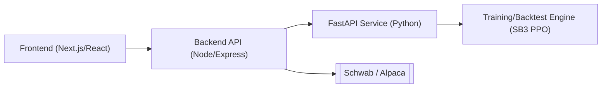

# StockBot Trading Pipeline

This document explains the end-to-end workflow of StockBot, a web-based deep‑reinforcement‑learning trading platform. It reflects the current codebase: FastAPI orchestration, Node/Express proxy, React frontend, and the SB3 PPO training and backtest engines.

---

## 1. System Overview

StockBot consists of a React frontend, a Node backend, a FastAPI service, and a Python training/backtest engine.

- Frontend: collects parameters for training/backtest, starts jobs, streams status, and downloads artifacts.
- Backend API: authenticates requests, persists run metadata, and proxies to the FastAPI service. Adds broker credential plumbing and policy upload.
- FastAPI: exposes StockBot job/control routes, TensorBoard data, probability tools, and static run files.
- Training/Backtest Engine: Python subprocesses launched by FastAPI for PPO training, evaluation, and backtests.

---

## 2. Pipeline Architecture

### 2.1 Frontend
- Training wizard with sections: Dataset, Features, Costs & Execution, CV/Stress, Regime, Model, Sizing, Reward & Logging, Downloads.
- Builds a typed payload (see 4.1) and posts to the backend at `/api/stockbot/train`.
- Streams job status via Server‑Sent Events (SSE) and shows artifacts; can cancel a run and download a ZIP bundle.

### 2.2 Backend API (Node/Express)
- JWT-protected routes; MongoDB used for users and preferences.
- Proxies to the Python service using `STOCKBOT_URL`:
  - POST `/stockbot/train`, `/stockbot/backtest`, `/stockbot/cv`
  - GET `/stockbot/runs`, `/stockbot/runs/:id`, `/stockbot/runs/:id/stream` (SSE)
  - Artifacts: `/runs/:id/files/:name`, `/runs/:id/bundle`
  - TensorBoard: `/runs/:id/tb/tags|scalars|scalars-batch|histograms|grad-matrix`
  - Policies: POST `/policies/upload` (for `.zip` SB3 models)
  - Insights: GET `/insights`, `/highlights` (broker‑aware)
- Live trading proxies exist: `/trade/start`, `/trade/stop`, `/trade/status` (FastAPI endpoints for these are reserved; wiring is in progress).

### 2.3 FastAPI Service (Python)
- StockBot routes (`stockbot/api/routes/stockbot_routes.py`):
  - POST `/api/stockbot/train`, `/backtest`, `/cv`
  - GET `/api/stockbot/runs`, `/runs/{id}`, `/runs/{id}/stream` (SSE) and optional `/runs/{id}/ws` (WebSocket)
  - Artifacts: `/runs/{id}/artifacts`, `/runs/{id}/files/{name}`, `/runs/{id}/bundle`, `/runs/{id}/cancel`, `DELETE /runs/{id}`
  - TensorBoard: `/runs/{id}/tb/tags|scalars|scalars-batch|histograms|grad-matrix`
  - Policies upload: POST `/policies`
  - Insights & Highlights: POST `/insights`, `/highlights`
- Probability tools (`/api/stockbot/prob`): train/infer light HMM‑based regime models.
- Static: mounts `stockbot/runs` under `/runs` for direct file access.

### 2.4 Training/Backtest Engine
- Trainer entrypoint: `python -m stockbot.rl.train_ppo`.
  - Reads an `EnvConfig` YAML (see 5) and infers train/eval splits when not provided.
  - Builds environments with `make_env` (single‑asset or portfolio), wraps with `as_float32`, `ObsNorm` (optional), and `Monitor`.
  - Policies: `mlp`, `window_cnn`, `window_lstm` feature extractors.
  - PPO knobs: `n_steps`, `batch_size`, `learning_rate`, `gamma`, `gae_lambda`, `clip_range`, `ent_coef`, `vf_coef`, `max_grad_norm`, `dropout`.
  - Callbacks: `EvalCallback`, `StopTrainingOnRewardThreshold`, and diagnostics with gradient logging.
  - Outputs: `ppo_policy.zip`, TensorBoard event files, CSV logs, `evaluations.npz`.
- Backtest entrypoint: `python -m stockbot.backtest.run` to evaluate a saved `.zip` or a built‑in baseline strategy.

---

## 3. Data & Feature Pipeline

The data layer has two paths that work together.

- Providers: `stockbot/ingestion/yfinance_ingestion.py` implements `IngestionProvider` for OHLCV. Interfaces live in `ingestion_base.py`.
- Classic adapters (used by gym envs):
  - `BarWindowSource` and `PanelSource` in `stockbot/env/data_adapter.py` fetch bars, compute indicators, align multi‑asset panels, and enforce lookback constraints.
  - Feature engineering uses the built‑in indicator set (log returns, RSI, ROC, MACD, stochastics, ATR, SMA/EMA, volume z‑scores). If `FeatureConfig.use_custom_pipeline = true`, it tries `stockbot/ingestion/feature_engineering.py` (rich TA + optional `pandas_ta`).
- Modern feature builder (used during API prep and CV):
  - `stockbot/ingestion/parquet_cache.ensure_parquet` creates cached CSV/“parquet” files for requested symbols and date ranges.
  - `stockbot/ingestion/dataset_manifest.build_manifest` records the dataset slice and sources.
  - `stockbot/features/builder.build_features` rolls `(T, lookback, N, F)` windows with embargo and optional normalisation.
  - `stockbot/env/env_builder.prepare_env` wires this flow and writes `dataset_manifest.json` and `obs_schema.json` into the run directory.
- Normalisation & casting: `ObsNorm` (training: updates stats; eval: freezes) and `as_float32` ensure stable dtype/shape.

---

## 4. Request Parameters

### 4.1 Training Endpoint `/api/stockbot/train`

The frontend submits a rich, typed payload (see `frontend/src/components/Stockbot/NewTraining/payload.ts`). Key groups:

- Dataset: `symbols[]`, `start_date`, `end_date`, `interval` (1d|1h|15m), `adjusted_prices`, `lookback`, `train_eval_split`, `custom_ranges?`.
- Features: `feature_set` (ohlcv|ohlcv_ta_basic|ohlcv_ta_rich), `ta_basic_opts?`, `normalize_observation`, `embargo_bars`.
- Costs & Execution: `commission_per_share`, `taker_fee_bps`, `maker_rebate_bps`, `half_spread_bps`, `impact_k`, `fill_policy` (next_open|vwap_window), `vwap_minutes?`, `max_participation`.
- CV & Stress: `cv = { scheme: purged_walk_forward, n_folds, embargo_bars }`, `stress_windows[]`.
- Regime: `enabled`, `n_states`, `emissions`, `features[]` (ret|vol|skew|dispersion|breadth), `append_beliefs_to_obs`.
- Model: `policy` (mlp|window_cnn|window_lstm), `total_timesteps`, `n_steps`, `batch_size`, `learning_rate`, `gamma`, `gae_lambda`, `clip_range`, `ent_coef`, `vf_coef`, `max_grad_norm`, `dropout`, `seed?`.
- Sizing: `mapping_mode` (simplex_cash|tanh_leverage), `invest_max?`, `gross_leverage_cap?`, `max_step_change`, `rebalance_eps`, `kelly{...}`, `vol_target{...}`, `guards{...}`.
- Reward: `base` (delta_nav|log_nav), `w_drawdown`, `w_turnover`, `w_vol?`, `w_leverage?`.
- Artifacts: `save_tb`, `save_action_hist`, `save_regime_plots`.

Server behavior:
- Persists `config.snapshot.yaml` (payload), `payload.json`, starts `train_ppo` as a subprocess, streams logs to `job.log`, and surfaces artifacts via API.
- SSE init event includes a hash of the payload and parsed configuration for client caching.

### 4.2 Backtest Endpoint `/api/stockbot/backtest`

- Parameters: `policy` (baseline name: flat|equal|first_long|random|buy_hold or `path/to/ppo_policy.zip`), `config_path`, optional `symbols[]`, `start`, `end`, `out_tag` or `out_dir`, and `normalize`.
- Outputs: `report/equity.csv`, `report/orders.csv`, `report/trades.csv`, `report/summary.json`, `report/metrics.json`.

---

## 5. Reinforcement‑Learning Environment

Environment schema (`stockbot/env/config.py`) is YAML‑serialised and used by the PPO trainer. Highlights:

- FeeModel: commissions, taker/maker fees, half‑spread bps, borrow fees.
- MarginConfig: gross/net leverage caps, per‑name caps, intraday flag, daily loss and drawdown kill‑switches.
- ExecConfig: order type, limit offsets, max participation, impact parameter, spread source, fill policy.
- RewardConfig: base mode and penalties (`w_drawdown`, `w_turnover`, `w_vol`, `w_leverage`), Sharpe options.
- EpisodeConfig: `lookback`, `start_cash`, `max_steps`, `allow_short`, `rebalance_eps`, `randomize_start`, `horizon`, `min_hold_bars`, mapping/turnover knobs (`mapping_mode`, `invest_max`, `max_step_change`).
- FeatureConfig: indicator list, `use_custom_pipeline`, `window` length.

Each run stores a snapshot of the payload and resolved config next to artifacts.

---

## 6. Markov Decision Process

RL models the environment as an MDP: observe state, choose action, receive reward, transition to next state. Transitions depend only on current state/action (Markov property).

---

## 7. Environment Builder

`make_env` constructs a single‑asset (`StockTradingEnv`) or multi‑asset (`PortfolioTradingEnv`) environment from `EnvConfig` and date splits.

- Observations:
  - `window`: last `lookback` bars with features in `(L, N, F)`.
  - `portfolio`: vector with cash fraction, leverage, drawdown, unrealised/realised P&L, rolling vol, and turnover; in portfolio env, includes current weights.
  - Optional regime/probability features are appended when enabled.
- Actions:
  - Single‑asset: continuous position in `[-1,+1]` or discrete `{short,flat,long}`.
  - Portfolio: either
    - `simplex_cash`: logits of length `N+1` → softmax allocation with a gated invest fraction `≤ invest_max`; per‑step turnover is capped by `max_step_change`, remainder stays in cash.
    - `tanh_leverage`: `N` logits → `tanh` weights with gross/per‑name caps.
- Reward shaping: delta/log NAV with optional penalties for drawdown, turnover, volatility, and leverage.
- Execution & costs: unified cost model (`execution_costs.py`) for commissions, spread/fees, and impact; supports `next_open` and `vwap_window` fill styles with participation caps.

---

## 8. Backtesting Engine

`stockbot/backtest/run.py` runs a deterministic episode using a baseline or an SB3 policy. It writes `equity.csv`, `orders.csv`, `trades.csv`, a `summary.json`, and computes metrics (total return, vol, Sharpe/Sortino, Calmar, max drawdown, turnover, hit rate, average trade P&L).

Cross‑validation scaffolding (`backtest/cv.py`) integrates the modern data pipeline and execution cost model for purged walk‑forward analysis.

---

## 9. Hyper‑parameter Tuning

### 9.1 PPO Knobs

- n_steps: larger values stabilise gradients (e.g., 4096).
- batch_size: divide `n_steps`; commonly `n_steps/4`.
- learning_rate: 3e‑5–5e‑5 (lower can reduce clipping pressure).
- gamma: 0.995–0.997.
- gae_lambda: 0.98–0.985.
- clip_range: 0.15–0.30.
- ent_coef: 0.02–0.05.
- vf_coef: 0.8–1.0.
- max_grad_norm: 1.0.
- dropout: regularisation for CNN/LSTM extractors.
- seed: set for reproducibility when comparing runs.

### 9.2 Environment & Reward

- mapping_mode: `simplex_cash` (long‑only) or `tanh_leverage` (long/short).
- invest_max: cap invested fraction (with `simplex_cash`).
- max_step_change: cap per‑step target change (turnover throttle).
- rebalance_eps: micro‑rebalance gate.
- penalties: `w_turnover`, `w_drawdown`, `w_vol`, `w_leverage`.
- lookback: bars in the observation window.

---

## 10. Model Architectures

- WindowCNNExtractor: treats `(L, N, F)` as a multi‑channel image, fuses with portfolio context.
- WindowLSTMExtractor: flattens to `(L, N*F)` and applies an LSTM.
- MLP: SB3 default for simpler scenarios.

---

## 11. Diagnostics & Telemetry

- TensorBoard: episodic reward, policy/value losses, entropy, gradient norms; includes gradient‑by‑layer matrix exposed via API (`/tb/grad-matrix`).
- SSE/WebSocket status: `/runs/{id}/stream` and `/runs/{id}/ws` provide live job updates.
- Artifacts map: metrics/equity/orders/trades/summary, config snapshot, model, job log, payload.

---

## 12. Example Configuration

High‑performing CNN setup (`window_cnn`):

- learning_rate = 3e‑5
- n_steps = 4096, batch_size = 1024
- gamma = 0.997, gae_lambda = 0.985
- clip_range = 0.15, ent_coef = 0.04, vf_coef = 1.0
- max_grad_norm = 1.0
- Env mapping `simplex_cash` with `invest_max = 0.70`, `max_step_change = 0.08`, `rebalance_eps = 0.02`
- Reward penalties `w_turnover = 0.001`, `w_drawdown = 0.10`

This favours steady policy updates and strong risk control. For bear markets, consider `tanh_leverage` or hedging assets to handle downtrends.

---

## 13. Visualisation & Reports

- Training: TensorBoard events (scalars, histograms), optional action histograms and regime diagnostics.
- Backtest: `equity.csv`, `trades.csv`, `orders.csv`, `metrics.json` for plotting equity, drawdown, and weights.

---

## 14. Notes & Recommendations

- The backend exposes rich run management and TensorBoard endpoints; the frontend consumes SSE to keep status live.
- Policy uploads are supported (SB3 `.zip`) for evaluation/backtests.
- Live trading routes are proxied in Node and reserved in the FastAPI API; server‑side wiring is being added.
- Validate environment logic and reward shaping early; monitor entropy and gradients; compare vs. baselines.

