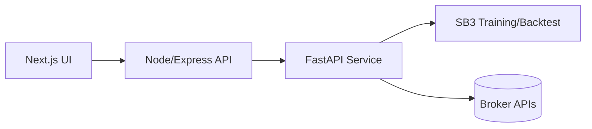

# StockBot Trading Pipeline

## Overview

StockBot is a web-based deep-reinforcement-learning trading platform. Users can train policies on historical data, run backtests, and download artifacts or start live trading sessions. The system is composed of a Next.js/React front-end, a Node/Express backend that handles authentication and data access, and a Python FastAPI service that orchestrates reinforcement-learning tasks built on stable-baselines3 (SB3). This document describes the pipeline, the reinforcement-learning environment and model architecture, and guidelines for tuning hyper-parameters and shaping rewards.

## Pipeline Architecture

### 1. Front-end (Next.js/React)
- Presents **New Training** and **New Backtest** forms.
- Submits parameters (symbols, date ranges, policy type, etc.) to the backend.
- Streams job status via REST or WebSocket and allows downloading run artifacts.

### 2. Backend API (Node/Express)
- Acts as the primary API gateway with JWT authentication and MongoDB persistence.
- Forwards training, backtest and live trading requests to the FastAPI service via Axios.
- Proxies WebSocket connections for real-time run status and exposes routes for run management, TensorBoard data and AI insights.
- Hosts broker endpoints for Schwab and Alpaca integration.

### 3. FastAPI Service
- Orchestrates reinforcement-learning tasks and broker operations.

**Training endpoint** (`/api/stockbot/train`)
- Merges overrides into an `EnvConfig` snapshot, infers train/eval splits, logs metadata and launches a Python subprocess.
- Subprocess runs `stockbot/rl/train_ppo.py`; environment variables are prepared and stdout/stderr are streamed to `job.log`.
- Run status, artifact paths and bundles are exposed via REST and WebSocket/SSE.

**Back-test endpoint** (`/api/stockbot/backtest`)
- Loads a saved model or baseline and builds an evaluation environment from the same configuration snapshot.
- Executes a deterministic episode (`stockbot/backtest/run.py`) producing equity, orders and trade CSVs plus summary metrics.

**Live trading endpoints** (`/api/stockbot/trade/*`)
- Start or stop trading sessions and query current status using a deployed policy against broker APIs.

### 4. Training Engine (SB3 PPO)
- Invoked as `python -m stockbot.rl.train_ppo`.
- Loads YAML configuration into an `EnvConfig` dataclass defining symbols, date range, features and reward weights.
- Infers train/eval splits (last calendar year or 80/20 split).
- Builds environments via `make_env`, choosing `StockTradingEnv` or `PortfolioTradingEnv`, optionally wrapping with `ObsNorm` and `Monitor`.
- Creates policy: choose MLP, `WindowCNN`, or `WindowLSTM` feature extractors. `WindowLSTMExtractor` processes `(L,N,F)` windows through an LSTM to provide temporal memory.
- Configures PPO hyper-parameters (`n_steps`, `learning_rate`, `gamma`, `gae_lambda`, `clip_range`, `ent_coef`, `vf_coef`, `max_grad_norm`, `dropout`, etc.).
- Trains via `model.learn` with `EvalCallback`, TensorBoard diagnostics and optional early stop (`StopTrainingOnRewardThreshold`).
 - Saves final policy as `ppo_policy.zip` and logs to TensorBoard/CSV.

## Request Parameters

### Training (`/api/stockbot/train`)

| Parameter | Type | Description |
|-----------|------|-------------|
| `symbols` | list[str] | Ticker symbols to include in the environment. |
| `start_date` / `end_date` | str | ISO dates delimiting the data slice. |
| `policy` | str | Feature extractor: `mlp`, `window_cnn`, or `window_lstm`. |
| `total_timesteps` | int | Number of environment steps for learning. |
| `eval_freq` | int | Steps between evaluation runs and model checkpoints. |
| `seed` | int | Random seed for reproducibility. |

### Backtest (`/api/stockbot/backtest`)

| Parameter | Type | Description |
|-----------|------|-------------|
| `model_path` | str | Path to a saved policy or baseline name. |
| `symbols` | list[str] | Optional override of tickers for evaluation. |
| `start_date` / `end_date` | str | Optional date range override. |
| `deterministic` | bool | Use deterministic actions during evaluation. |

Common environment parameters referenced above are defined in the YAML snapshot (`EnvConfig`): `lookback`, `invest_max`, `max_step_change`, `rebalance_eps` and reward weights (`w_turnover`, `w_drawdown`, `w_vol`, `w_leverage`).

## Reinforcement-Learning Environment

### Markov Decision Process

Reinforcement learning assumes the environment is a Markov decision process: at each step the agent observes a state, chooses an action, receives a reward and transitions to a new state. The Markov property states that the next state and reward depend only on the current state and action.

### Environment Builder

`make_env` builds either `StockTradingEnv` (single asset) or `PortfolioTradingEnv` (multi‑asset) using market data from the YAML configuration (via the YFinance provider). Observations are returned as a dictionary:

- **window** – tensor `(lookback, N, F)` with the last `lookback` bars for `N` assets and `F` features (OHLCV plus indicators).
- **portfolio** – vector summarizing cash fraction, gross leverage, current drawdown and current weights.

Actions differ by environment:

- `StockTradingEnv`: `action_space="weights"` or `"discrete"`. Continuous mode uses a scalar in [-1,+1] representing the target position (short/flat/long); discrete mode maps {0,1,2} to short/flat/long.
- `PortfolioTradingEnv`: action vector of length `N` (or `N+1` depending on mapping). Logits map to weights via:
  - **simplex_cash** (default) – sigmoid gate controls investment fraction and softmax yields non‑negative weights summing to ≤ `invest_max`; a turnover cap (`max_step_change`) limits thrashing.
  - **tanh_leverage** – logits pass through `tanh` allowing long/short exposure; weights may be negative but are clipped to obey a gross leverage limit (`invest_max` ignored).

Reward shaping is configured in YAML. Base reward is delta NAV or log NAV. Optional penalties:

- `w_drawdown` – multiplies current drawdown to discourage large equity drops.
- `w_turnover` – penalizes absolute weight changes to reduce over-trading.
- `w_vol` – penalizes recent return volatility.
- `w_leverage` – penalizes gross exposure beyond leverage cap.

## Back-testing Engine

`stockbot/backtest/run.py` loads a saved policy or baseline strategy and runs a deterministic episode in the evaluation environment. It records equity, cash and weights each step, writes CSVs, reconstructs orders/trades and computes metrics: total return, annualized volatility, Sharpe/Sortino ratios, max drawdown, turnover, hit rate and average trade P&L. Policies can be compared against baselines such as equal-weight or buy‑and‑hold.

## Hyper-parameter Tuning

### Major PPO Parameters
- `n_steps` – environment steps per update. Larger values stabilize gradient estimates at the cost of memory; `4096` used in final runs.
- `batch_size` – SGD mini-batch size; should divide `n_steps`, typically `n_steps/4`.
- `learning_rate` – step size for gradient descent. `3e-5`–`5e-5` effective after `1e-4` caused clipping.
- `gamma` – discount factor; `0.995`–`0.997` encourages long-term returns.
- `gae_lambda` – bias/variance trade-off for GAE; `0.98`–`0.985` yields smoother updates.
- `clip_range` – PPO clip parameter; `0.15`–`0.3`.
- `ent_coef` – entropy coefficient (`0.02`–`0.05`) to encourage exploration.
- `vf_coef` – weight on value loss (`0.8`–`1.0`) for better advantage estimates.
- `max_grad_norm` – gradient clipping threshold (`1.0` to prevent explosions).
- `dropout` – regularizes feature extractor networks.
- `seed` – reproducibility.

### Environment and Reward Parameters
- `mapping_mode` – `simplex_cash` for long-only with cash; `tanh_leverage` allows shorting.
- `invest_max` – max fraction of equity invested (simplex_cash).
- `max_step_change` – caps per-step weight changes.
- `rebalance_eps` – minimum weight change before rebalancing.
- `w_turnover`, `w_drawdown`, `w_vol` – reward penalties for turnover, drawdown and volatility.
- `lookback` – number of past bars in the observation window.

## Model Architectures
- **WindowCNNExtractor** – treats `(L,N,F)` window as multi‑channel image for 2D convolutions before merging with portfolio features.
- **WindowLSTMExtractor** – flattens to `(L, N*F)` and feeds into LSTM for long-term dependencies.
- **MLP** – default SB3 extractor for simple use cases.

## Diagnostics and Debugging
The Milvus RL debugging guide recommends:

- Inspect reward signals to ensure they align with the trading objective.
- Verify environment transitions (cash, positions, equity) with unit tests.
- Monitor exploration/exploitation by plotting policy entropy and action histograms; adjust `ent_coef` if entropy collapses.
- Tune hyper-parameters when returns oscillate or gradients explode. Lowering learning rate, increasing `n_steps` and raising `vf_coef` improved stability in experiments.

## Winning Example: Tuning Summary
Best run used the CNN extractor (`window_cnn`) with:

- `learning_rate = 3e‑5`
- `n_steps = 4096`, `batch_size = 1024`
- `gamma = 0.997`, `gae_lambda = 0.985`
- `clip_range = 0.15`, `ent_coef = 0.04`, `vf_coef = 1.0`
- `max_grad_norm = 1.0`
- Environment mapping `simplex_cash` with `invest_max = 0.70`, `max_step_change = 0.08`, `rebalance_eps = 0.02`
- Reward penalties `w_turnover = 0.001`, `w_drawdown = 0.10`

This configuration encouraged long-term planning, careful policy updates and strong risk control. The policy held positions longer, traded infrequently and achieved positive risk-adjusted returns on out-of-sample assets (e.g., XOM/CVX). However, because `simplex_cash` prohibits short selling, the model lost money during broad downturns; enabling shorting (`tanh_leverage`) or adding hedging assets can improve bear-market performance.

## Visualization and Graphs

Training runs log metrics to **TensorBoard**, producing graphs for episodic reward, value/policy loss, entropy and gradient norms. The `DiagnosticsCallback` optionally adds action histograms and weight distributions.  
Backtests output `equity.csv` and `drawdown.csv` for plotting equity curves, drawdown profiles and per-asset weight trajectories. These visualizations help users assess policy behavior and compare against baseline strategies.

## Conclusion and Recommendations
StockBot integrates deep reinforcement learning into a full web application. A carefully designed environment and reward structure, combined with appropriate hyper-parameter tuning, are essential for profitable behaviour. Use baselines for comparison, monitor diagnostics (rewards, gradients, entropy, weight histograms) and validate environment logic with unit tests. With the provided pipeline, researchers and practitioners can experiment with architectures, reward functions and market universes to craft robust trading strategies.
