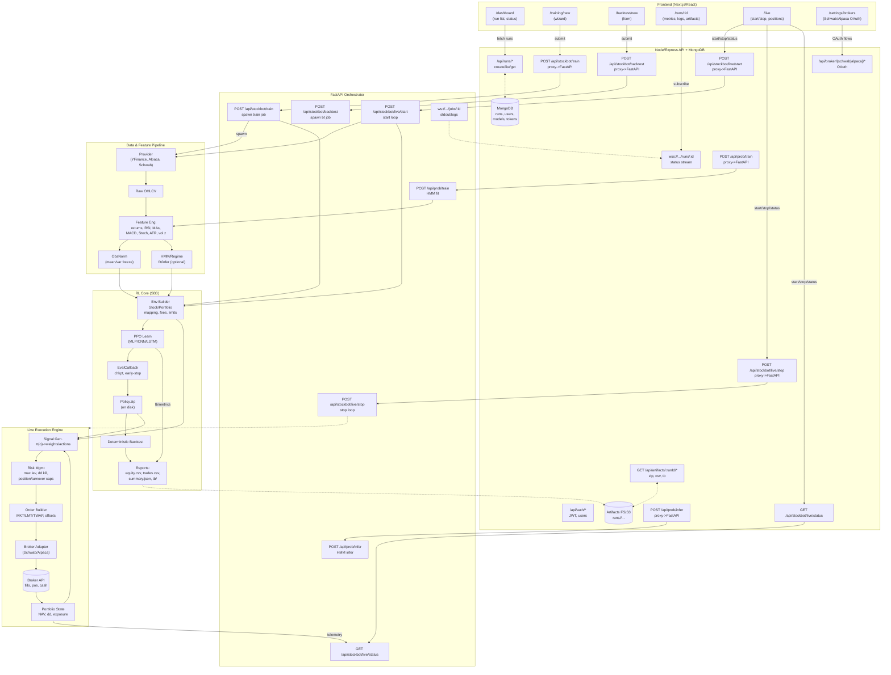

# StockBot Trading Pipeline

**Last updated:** September 4, 2025 (America/New_York)

StockBot is a web‑based deep‑reinforcement‑learning trading platform. Users can train policies on historical data, run backtests and start live trading sessions. The system comprises a Next.js/React front‑end, a Node/Express backend (auth, runs, artifacts, broker auth) and a Python FastAPI service that orchestrates stable‑baselines3 (SB3) training/backtests and live execution.

<!-- More content will be appended after writing this core section -->

## 1) Front‑End (Next.js/React)

### Pages
- `/dashboard`: run list, latest status, quick links.
- `/training/new`: multi‑step wizard; client‑side validation; preview YAML snapshot.
- `/backtest/new`: model selector + evaluation slice.
- `/runs/:id`: live logs (WS/SSE), charts (equity/drawdown), artifacts download.
- `/live`: start/stop, current positions, PnL, exposure, recent fills.
- `/settings/brokers`: Schwab/Alpaca OAuth connect + token state.

### Patterns
- TanStack Query for data fetching/caching.
- WebSocket to `/runs/:id` for status/log lines.
- File downloads proxied by backend (`/api/artifacts/:runId/*`).

## 2) Backend API (Node/Express)

### Auth & Users
| Route              | Method | Purpose        |
|-------------------|--------|----------------|
| /api/auth/login   | POST   | JWT issue      |
| /api/auth/refresh | POST   | Refresh token  |
| /api/auth/me      | GET    | Current user   |

### Runs & Artifacts
| Route                            | Method | Purpose        |
|----------------------------------|--------|----------------|
| /api/runs                        | GET    | List runs      |
| /api/runs                        | POST   | Create metadata|
| /api/runs/:id                    | GET    | Get run        |
| /api/artifacts/:id/zip           | GET    | Zip bundle     |
| /api/artifacts/:id/:path*        | GET    | Direct file    |

### Orchestration (proxied to FastAPI)
| Route                        | Method | Purpose           |
|-----------------------------|--------|--------------------|
| /api/stockbot/train         | POST   | Start train job    |
| /api/stockbot/backtest      | POST   | Start backtest     |
| /api/stockbot/live/start    | POST   | Launch loop        |
| /api/stockbot/live/stop     | POST   | Stop loop          |
| /api/stockbot/live/status   | GET    | Live state         |
| /api/prob/train             | POST   | Fit HMM            |
| /api/prob/infer             | POST   | Infer regimes      |

### Brokers
| Route                                | Method | Purpose        |
|--------------------------------------|--------|----------------|
| /api/broker/schwab/auth              | GET    | OAuth start    |
| /api/broker/schwab/callback          | GET    | OAuth callback |
| /api/broker/alpaca/auth              | GET    | OAuth start    |
| /api/broker/alpaca/callback          | GET    | OAuth callback |

### Persistence
- **MongoDB**: users, runs, live_sessions, tokens, models.
- **Artifacts**: runs/<runId>/env.yaml, policy.zip, equity.csv, trades.csv, summary.json, tb/, job.log.

### Streaming
- `wss://.../runs/:id`: job status + log tails (proxied from FastAPI’s `/jobs/:id`).

